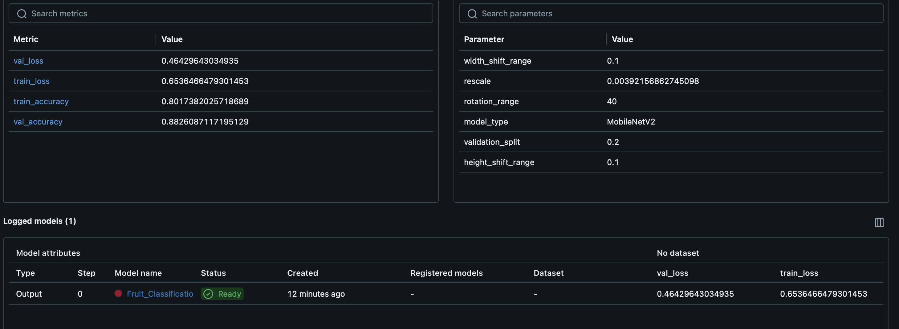

# Projet Finale de DevOps/ MlOps
Fait par Yelemeu Rick Georges, Ngy François, Theissen Antoine

## Quel est nôtre projet ?

Ce projet est une démonstration de bout-en-bout d'un pipeline MLOps :
- Entraînement d'un modèle avec MLflow.
- Déploiement d'une API FastAPI pour effectuer des prédictions sur des images.
- Conteneurisation complète avec Docker & Docker Compose.
- Provisionnement d'infrastructure cloud (AWS) avec Terraform.
- La partie Machine Learning porte sur la classification de fruit a partir d'image.

---
## Fonctionnement de l'algorithme de Deep Learning

L'entraînement du modèle s'appuie sur le transfert d'apprentissage avec MobileNetV2, un réseau de neurones convolutif pré-entraîné sur ImageNet. Ce modèle est  adapté à la classification d'images.

Dans notre pipeline, MobileNetV2 est utilisé comme base gelée (les poids ne sont pas réentraînés), à laquelle on ajoute plusieurs couches denses pour adapter le modèle à la classification des 10 catégories de fruits. L'entraînement se fait sur des images prétraitées (redimensionnées, normalisées et augmentées) afin d'améliorer la robustesse du modèle. La fonction de perte utilisée est la cross-entropy catégorielle, adaptée à la classification multi-classes.

En plus des parametres données à l'algorithme on peut aussi augmenter le nombre de fois que l'algo se lance pour améliorer ses performances (ici on a choisi 5: ligne 203)

### Pourquoi MobileNetV2 ?

- **Performance** : MobileNetV2 offre un excellent compromis entre précision et rapidité, ce qui le rend idéal pour des applications en production ou sur des machines avec peu de ressources.
- **Transfert d'apprentissage** : En utilisant des poids pré-entraînés, le modèle bénéficie d'une compréhension générale des images, ce qui accélère l'entraînement et améliore la généralisation sur notre jeu de données spécifique.
- **Simplicité d'intégration** : MobileNetV2 est facilement intégrable avec TensorFlow/Keras et compatible avec MLflow pour le suivi des expériences.

Ce choix permet d'obtenir un modèle efficace, rapide à entraîner et facilement déployable dans une API pour la prédiction en temps réel.
## Les résultat de nôtre modèle sur MLFlow UI


## Fonctionnement de l'API (FastAPI)

L'api se base sur le travail précédemment fait sur le train.py. En effet on utilise mlflow pour enregistrer un modèle de machine learning et pouvoir l'exploiter par d'autre process sans avoir a relancer le machine learning a chaque instance.

Ici on utilise flaskAPI car elle est simple a comprendre et a mêttre en place. Le process est simple, la page principale a un formulaire ou l'on peut inserer une image, dans le réperetoire data/predict on a des images qui servent a tester nôtre modèleS. Vous pouvez en seletionner une et ensuite cliquer sur "Prédire" pour ensuite être rediriger vers la réponse envoyer par nôtre modèle. Il existe 10 catégorie de fruit:
- Apple
- Avocado
- Banana
- Cherry
- Kiwi
- Mango
- Orange
- Pineapple
- Strawberries
- Watermelon

Libre a vous d'essayer des images qui ne sont pas des fruits mais il est peu probable que le modèle soit performant quand il s'agit de voiture 


## Comment utiliser nôtre projet 


###  Lancer le projet en local
Prérequis : Avoir Docker Desktop installer et lancer sur la machine !

Pour des raisons de simpliciter d'utilisation et de prise en main l'entiereté du code est executable avec la commmande suivante :
````bash
bash launch.sh
````
Pour comprendre de quoi il s'agit, launch.sh est un simple fichier bash qui va se charger de la création du dossier, de l'import des fichiers depuis github et du lancement de docker automatiquement. Normalement si tout fonctionne bien vous devriez voir ici http://localhost:8000

